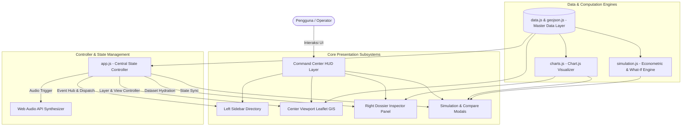

# 🏗️ Nusantara Digital Twin Architecture & Technical Design

Dokumen ini menjelaskan arsitektur sistem, topologi komponen, alur data (*data pipeline*), serta pola rekayasa perangkat lunak yang diterapkan pada platform **Nusantara Digital Twin (Indonesia 2045)**.

---

## 1. Ikhtisar Arsitektur

Nusantara Digital Twin dirancang dengan arsitektur **Zero-Heavy-Build Modular Client-Side Engine**. Pendekatan ini memungkinkan platform beroperasi dengan latensi mendekati nol, tidak membutuhkan runtime compiler yang lambat, dan dapat dihosting secara statis (*Edge/CDN*) dengan reliabilitas tinggi.

---

## 2. Struktur Modul & Tanggung Jawab (Separation of Concerns)

Setiap berkas dalam arsitektur memiliki batasan tanggung jawab yang jelas dan terisolasi:

| Berkas / Modul | Tanggung Jawab Utama | Dependensi Eksternal |
|---|---|---|
| **`index.html`** | Struktur semantik DOM Command Center, panel layout 3 kolom, modal sandbox, dan accessibility hooks. | Leaflet CSS/JS, Chart.js, Google Fonts |
| **`css/style.css`** | *Cyber Dark HUD Design System*, variabel CSS, efek *glassmorphism*, animasi denyut (*pulse*), stylesheet cetak, & responsivitas media queries. | Google Fonts (Inter, Rajdhani, Share Tech Mono) |
| **`js/data.js`** | Master single-source-of-truth 38 provinsi di Indonesia, telemetri IoT statis/dinamis, layer Palapa Ring, Tol Laut, EBT Nodes, dan konstanta nasional. | None |
| **`js/geojson.js`** | Poligon geospasial batas wilayah 38 provinsi di Indonesia terkompresi dan terindeks berdasarkan kode provinsi (`id`). | None |
| **`js/charts.js`** | Factory visualisasi grafik Chart.js: Radar Chart 5 Pilar, Bar Chart Sektor Ekonomi, Doughnut Demografi Usia, dan Sparkline sensor grid. | Chart.js 4.x |
| **`js/simulation.js`** | Algoritma What-If Sandbox Indonesia 2045: rumus elastisitas PDB/PDRB, proyeksi IPM, dekarbonisasi Net-Zero, dan generator diagnosis AI eksekutif. | `data.js` |
| **`js/map.js`** | Instansiasi Leaflet GIS Map, rendering poligon GeoJSON, kalkulasi warna 5 mode choropleth, layer switchers, dan interaksi hovering/clicking. | Leaflet 1.9.4 |
| **`js/app.js`** | Orchestrator pusat: *Application State Manager*, routing tab dossier, pencarian & filter direktori, kiosk auto-tour, export CSV/JSON/PDF, dan sound synthesis. | Semua modul di atas |

---

## 3. Alur Data & State Flow

Platform menggunakan paradigma **Unidirectional Data Flow**:

1. **State Initialization**: `app.js` menginisialisasi `currentProvinceId` (default: `IKN` / Kalimantan Timur), `currentChoroplethMode` (default: `ipm`), dan mengaktifkan interval jam 3 zona waktu (WIB, WITA, WIT).
2. **Layer Rendering**: `map.js` membaca `PROVINCES_DATA` dan `INDONESIA_GEOJSON` untuk membuat layer SVG Leaflet yang responsif.
3. **User Action**: Pengguna mengklik salah satu provinsi pada peta atau direktori:
   - Event listener memanggil `app.selectProvince(provinceId)`.
   - `map.js` melakukan *smooth pan & zoom* ke koordinat provinsi.
   - `charts.js` menghancurkan (*destroy*) instans chart sebelumnya untuk mencegah *memory leak* dan merender ulang grafik data baru.
   - `app.js` mengupdate seluruh indikator dossier di panel kanan.
   - `soundEngine` membunyikan sinyal frekuensi synth 880Hz / 440Hz via Web Audio API.

---

## 4. Efisiensi Memori & Optimasi Performa

- **Pembersihan Canvas Chart.js**: Setiap fungsi render di `charts.js` memeriksa instans chart aktif (`chartInstance.destroy()`) sebelum membuat instans baru guna menghindari *canvas memory bloat*.
- **Debounced Search**: Input pencarian direktori provinsi menggunakan debouncing untuk mencegah reflow DOM yang berlebihan.
- **Synthesized Audio**: Tidak ada *asset network request* untuk audio WAV/MP3. Seluruh efek suara (*cyber beep, scan hum, switch chime*) dihasilkan secara matematis menggunakan Web Audio API `OscillatorNode` dan `GainNode`.
- **Hardware Acceleration**: Transformasi UI menggunakan `transform: translate3d()` dan `will-change` pada elemen yang sering dianimasikan.

---

## 5. Protokol Keamanan & Sanitasi

1. **Zero External Data Injection**: Platform tidak mengeksekusi `eval()` atau injeksi skrip eksternal tak tepercaya.
2. **Data Sanitization**: Fungsi ekspor (CSV/JSON/PDF) menyaring karakter kontrol dan menggunakan UTF-8 BOM encoding (`\uFEFF`) agar data tabular dapat dibuka sempurna di Microsoft Excel tanpa distorsi karakter.
3. **Sandboxed Iframe / Modal Safety**: Modal simulasi dan dossier diisolasi dalam DOM tree terstruktur dengan keyboard trap (`Escape` handler) untuk kepatuhan aksesibilitas.
